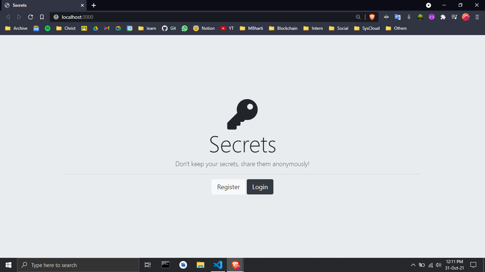
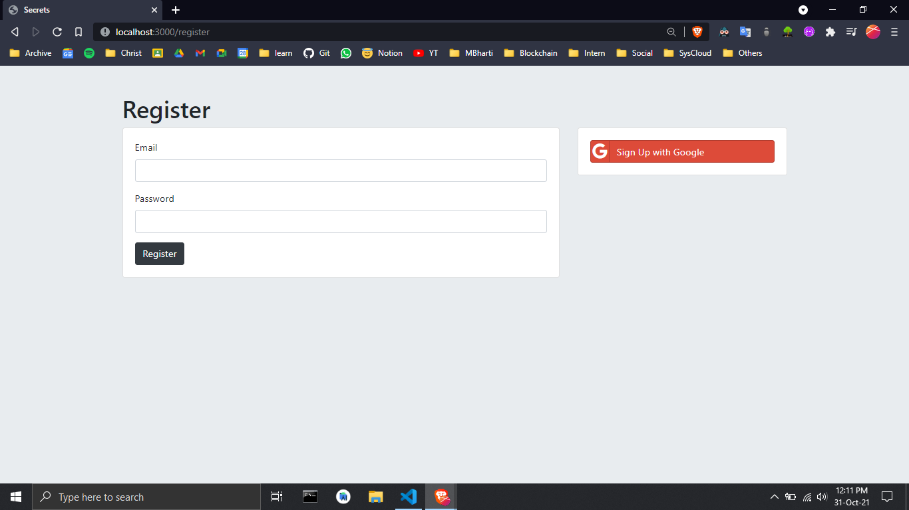
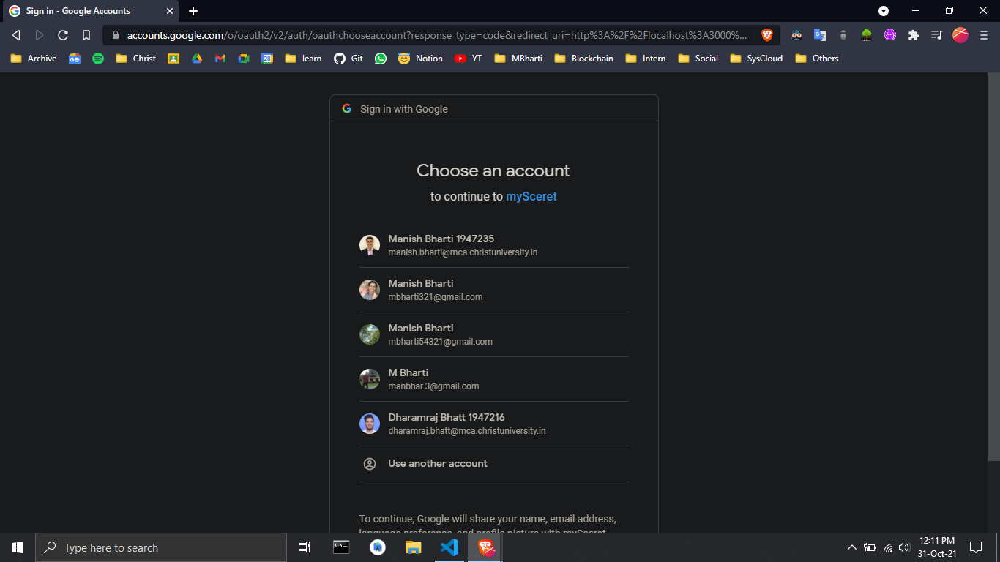
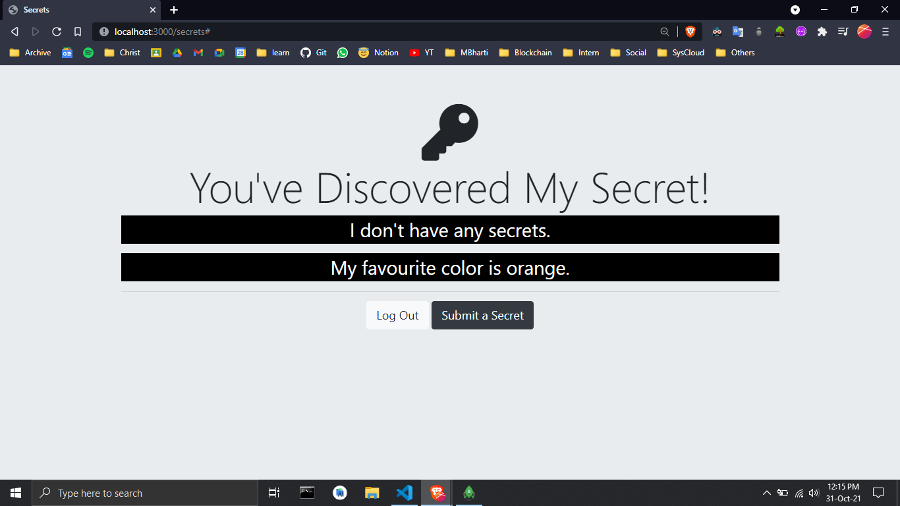
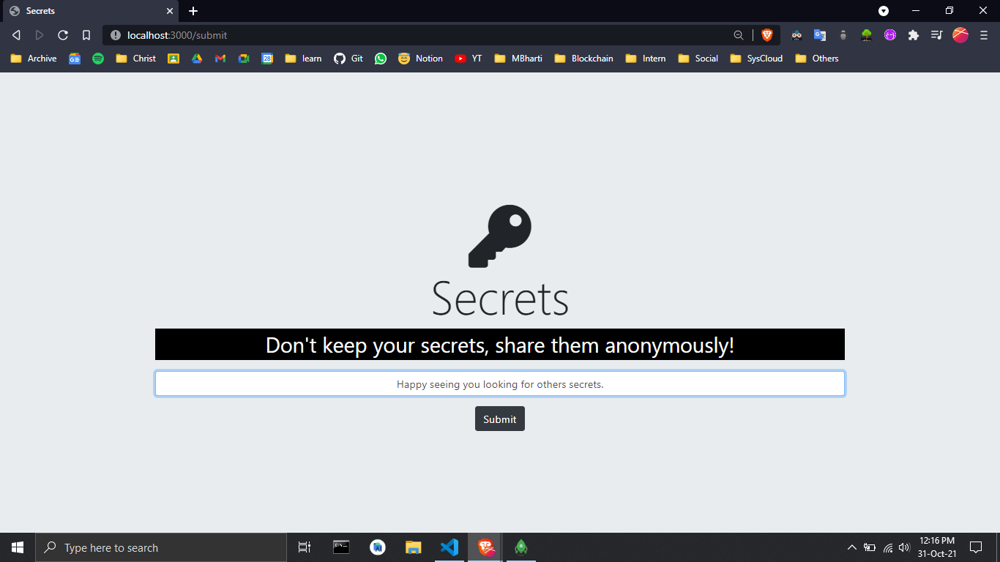
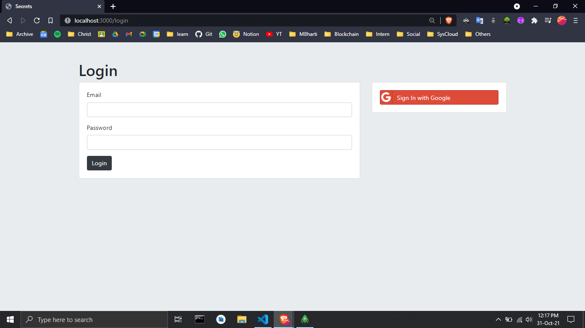

# Secrets-with-AuthenticationAndSecurity
- **Using:**
  - Node.js
  - express-session
  - passport
  - passport-local
  - passport-local-mongoose

## Screebshots
1>
- Landing page
  

2>
- Register Page
  

3>
- SignUp using Google OAuth
  

4>
- View Secrets
  

5>
- Submit Secrets
  

6>
- Login
  

